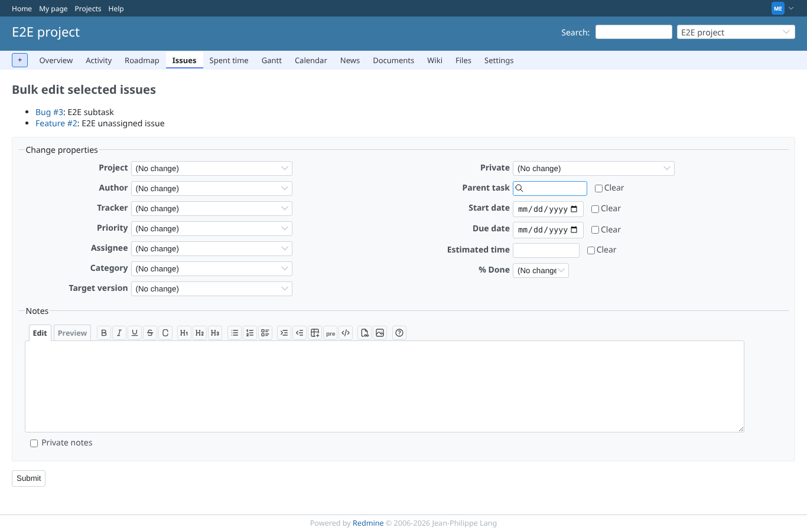
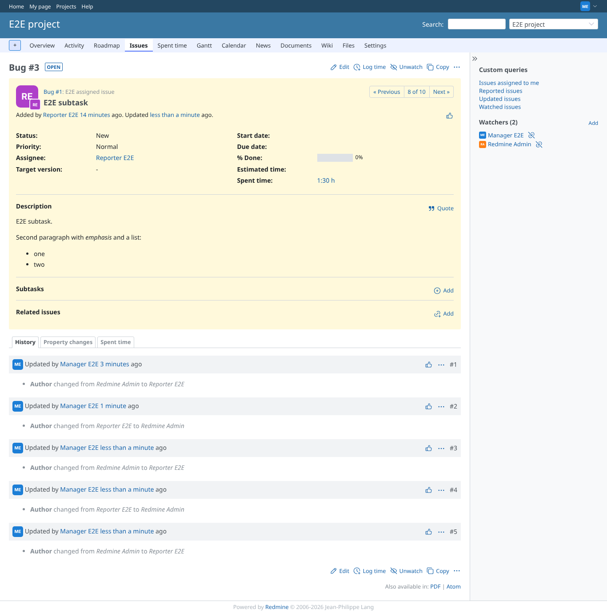
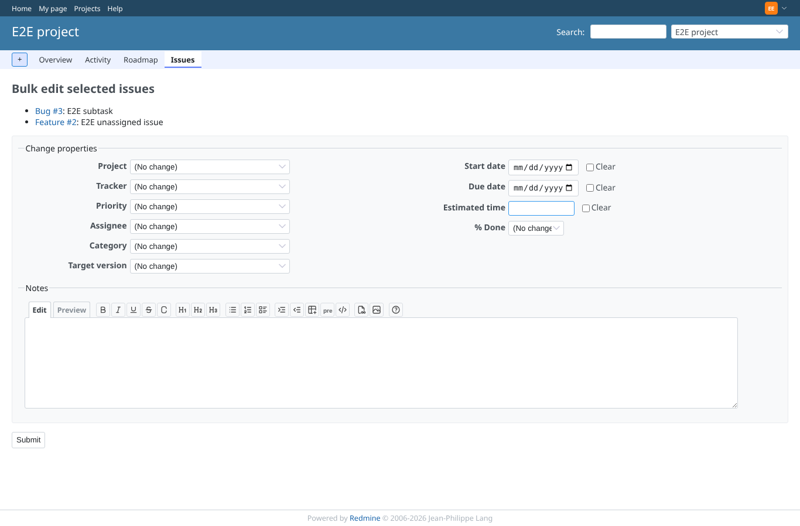
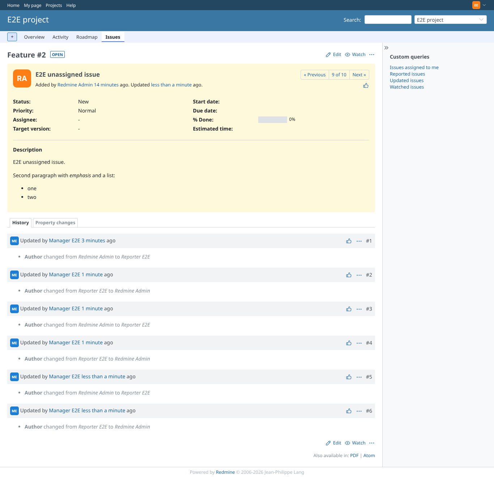

# bulk-edit-author

Run 2026-10-06T19:24:50.426Z against http://127.0.0.1:3000.

| screenshot | user | URL | shows |
|---|---|---|---|
|  | manager | `/issues/bulk_edit?ids[]=2&ids[]=3` | Bulk edit form with the author select, "(No change)" first |
|  | manager | `/issues/3` | Issue 3 after the bulk edit shows the new author |
|  | reporter | `/issues/bulk_edit?ids[]=2&ids[]=3` | Without edit permission bulk edit is refused, no author field reachable |
|  | editor | `/issues/bulk_edit?ids[]=2&ids[]=3` | An editor without edit_issue_author: bulk edit works but has no author field |
|  | editor | `/issues/2` | A forged bulk author_id from an editor without the permission is ignored |
