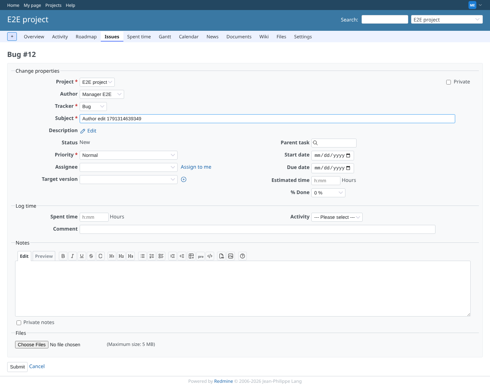
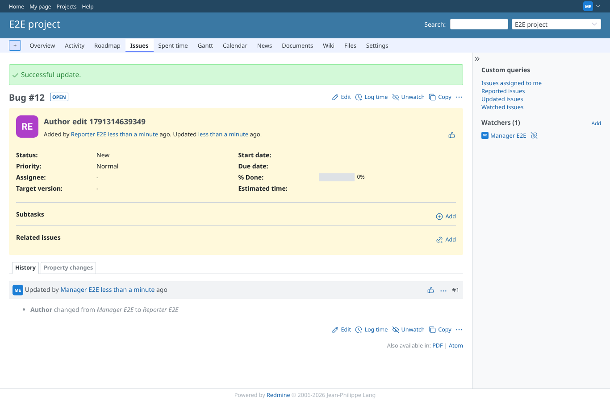
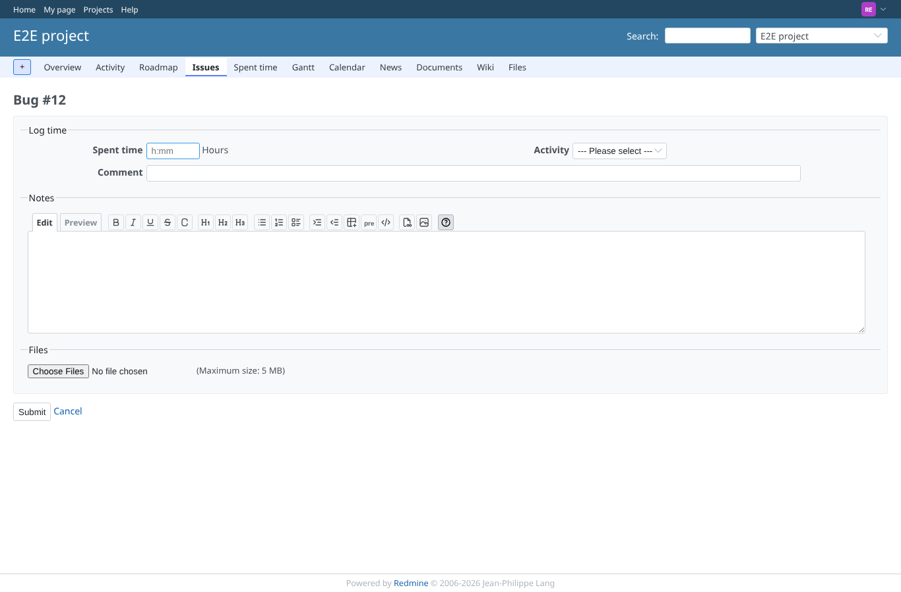
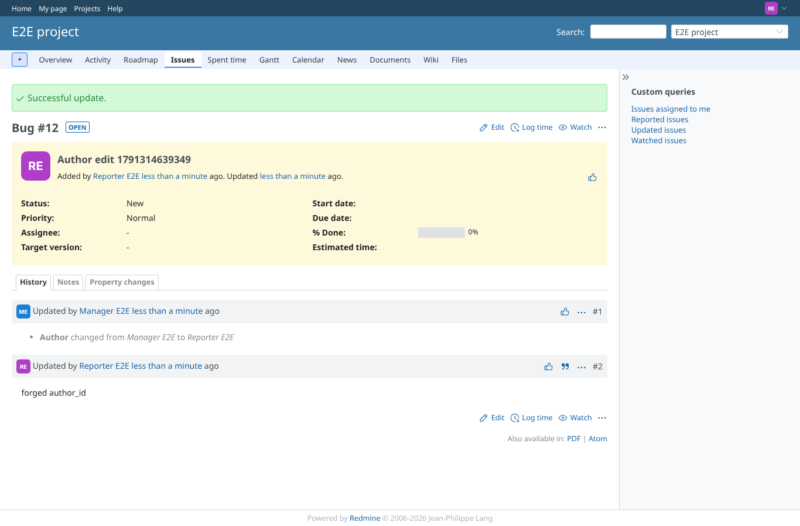
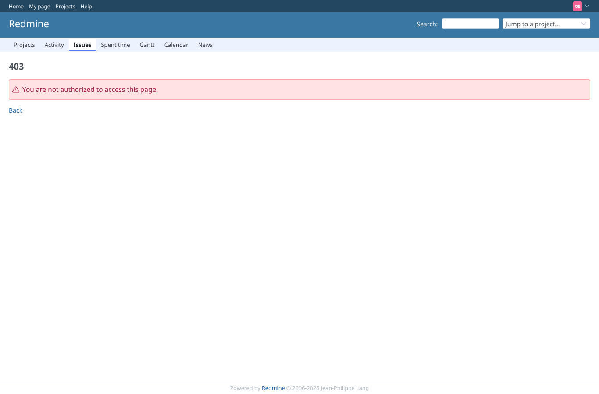

# edit-issue-author

Run 2026-10-06T19:24:07.982Z against http://127.0.0.1:3000.

| screenshot | user | URL | shows |
|---|---|---|---|
|  | manager | `/issues/12/edit` | Edit form with the author select above the tracker, for a member with edit_issue_author |
|  | manager | `/issues/12` | History shows "Author changed from Manager E2E to Reporter E2E" with names, not ids |
|  | reporter | `/issues/12/edit` | Without edit_issue_author the edit form has no author field |
|  | reporter | `/issues/12` | A forged issue[author_id] from a user without the permission is ignored, author unchanged |
|  | outsider | `/issues/6` | Outsider gets no access to a private issue |
