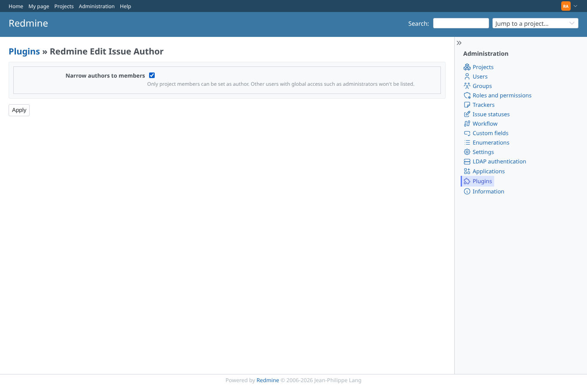
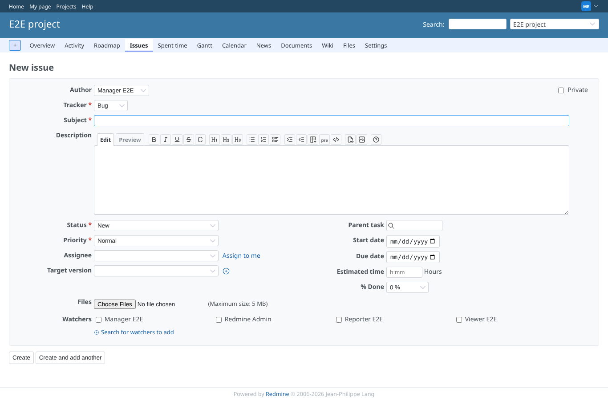

# members-scope-setting

Run 2026-10-06T19:23:50.633Z against http://127.0.0.1:3000.

| screenshot | user | URL | shows |
|---|---|---|---|
|  | admin | `/settings/plugin/redmine_editauthor` | Plugin settings, members scope off |
|  | manager | `/projects/e2e-project/issues/new` | Possible authors with the default setting: Manager E2E, Redmine Admin, Reporter E2E |
|  | admin | `/settings/plugin/redmine_editauthor` | Plugin settings, members scope on |
|  | manager | `/projects/e2e-project/issues/new` | Possible authors with members scope: Manager E2E, Redmine Admin, Reporter E2E, Viewer E2E |
|  | admin | `/settings/plugin/redmine_editauthor` | Plugin settings, members scope off |
