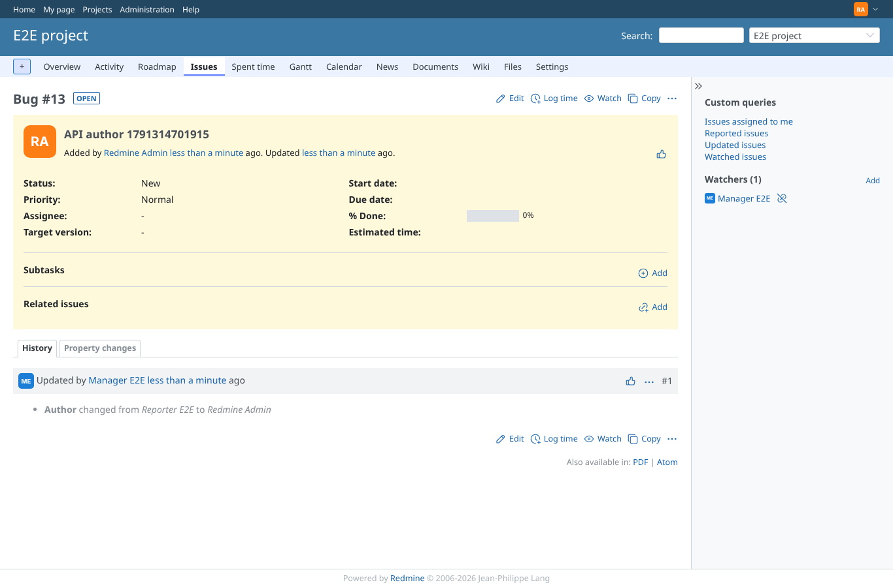

# rest-api-author

Run 2026-10-06T19:25:03.415Z against http://127.0.0.1:3000.

| screenshot | user | URL | shows |
|---|---|---|---|
|  | admin | `/issues/13` | API calls: create with author: POST /issues.json as manager -> HTTP 201 | change author: PUT /issues/13.json as manager -> HTTP 204 | create as editor: POST /issues.json as editor -> HTTP 201 | update as editor: PUT /issues/14.json as editor -> HTTP 204 | issue JSON author after change: {"id":1,"name":"Redmine Admin"} |
