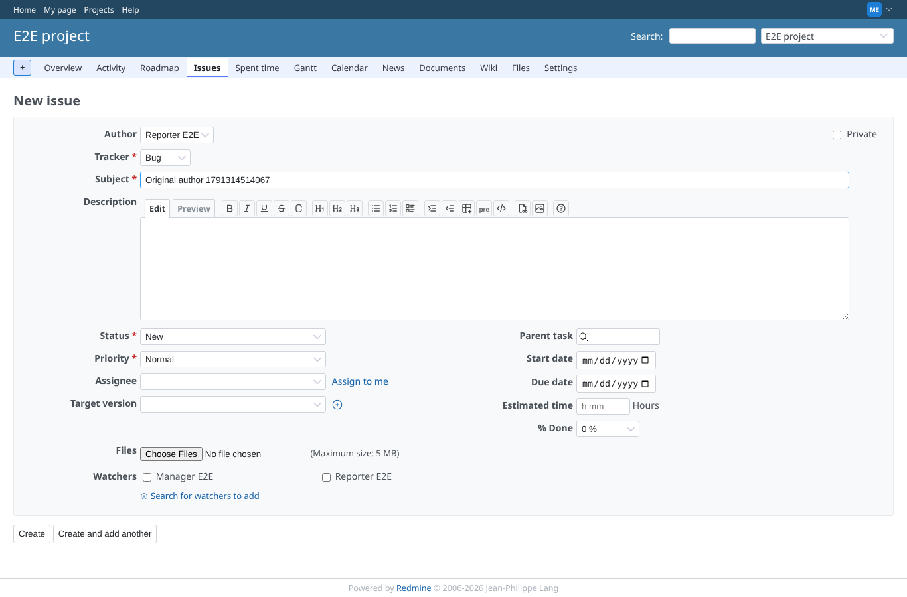
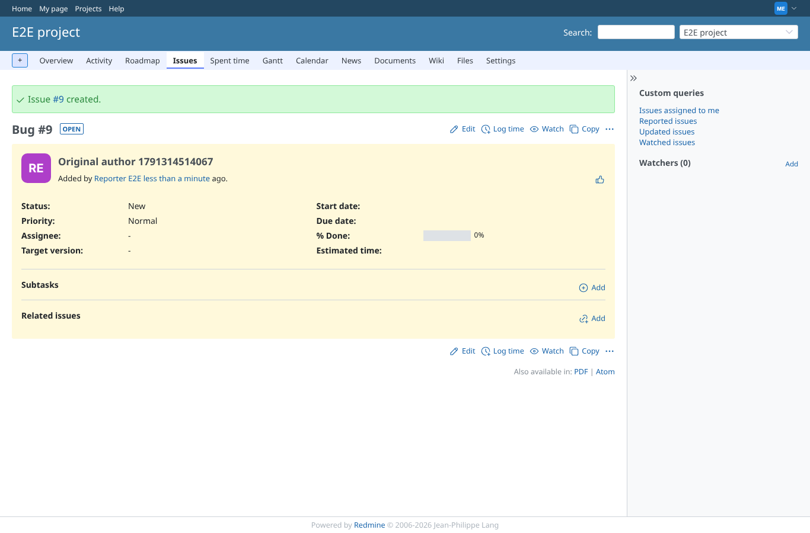
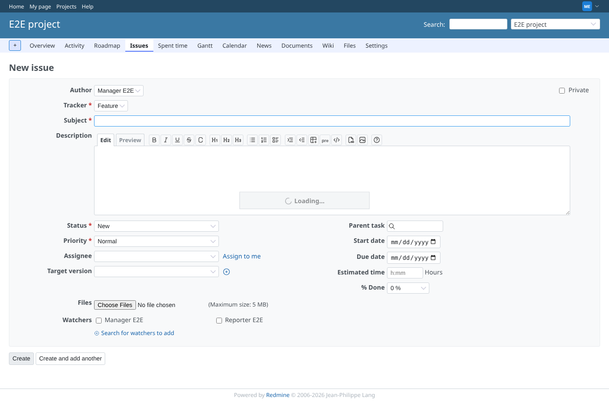
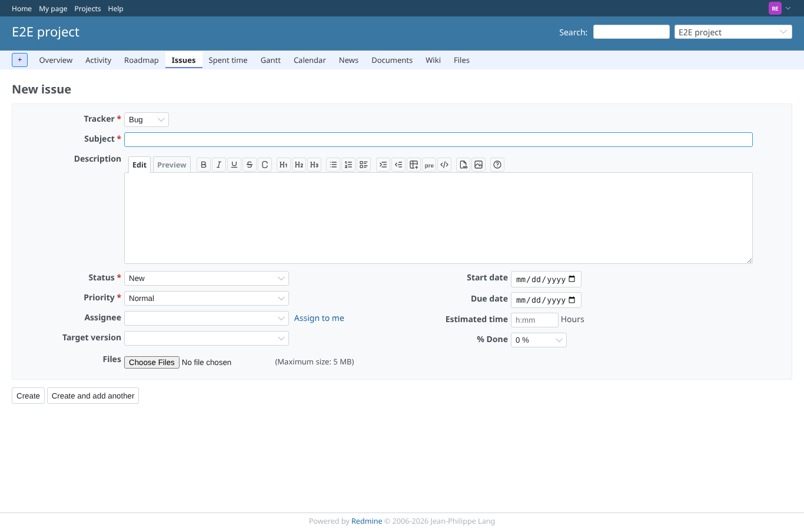
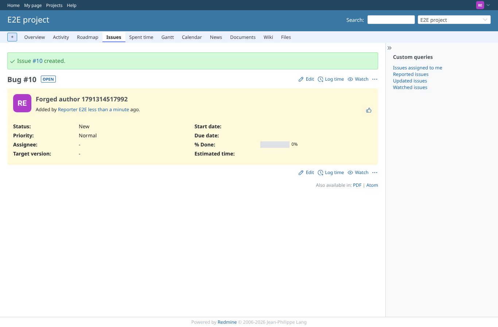

# set-original-issue-author

Run 2026-10-06T19:21:58.875Z against http://127.0.0.1:3000.

| screenshot | user | URL | shows |
|---|---|---|---|
|  | manager | `/projects/e2e-project/issues/new` | New issue form with the author select, Reporter E2E chosen |
|  | manager | `/issues/9` | The issue is created with Reporter E2E as author, not the creating manager |
|  | manager | `/projects/e2e-project/issues/new` | After a tracker change the form reloads and still shows exactly one author field |
|  | reporter | `/projects/e2e-project/issues/new` | Without set_original_issue_author the new form has no author field |
|  | reporter | `/issues/10` | A forged author_id on create is ignored, the reporter stays author |
